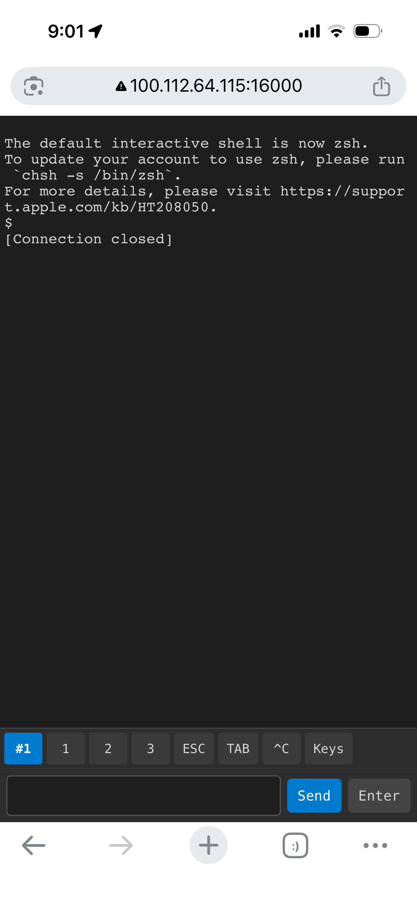

# Foxtrot



Web terminal built on [@xterm/xterm](https://xtermjs.org/) with a Korean input buffer. Designed to work around unstable Korean IME behavior in mobile browsers (especially iPhone Safari) when interacting directly with @xterm/xterm.

## Features

- **@xterm/xterm terminal** — Full terminal emulation powered by [@xterm/xterm](https://xtermjs.org/)
- **Korean input buffer** — Stable Hangul IME composition via a standard `<input>` field
- **Multi-tab sessions** — Multiple independent shell sessions with tab switcher
- **Persistent sessions** — Shells stay alive across browser reconnects
- **Optional auth** — JWT + SQLite login with `--auth` flag
- **Special keys toolbar** — ESC, TAB, Ctrl combos, arrow keys, function keys, and more
- **Mobile optimized** — Virtual keyboard doesn't push content off screen
- **Dark theme** — Terminal-native look and feel

## Quick Start

```bash
npm install
node server.js
```

Open `http://localhost:16000` in your browser.

### Options

```bash
node server.js --port 8080       # Custom port
node server.js -w /tmp           # Custom start directory
```

### Authentication

To enable login, set `JWT_SECRET` and pass `--auth`:

```bash
JWT_SECRET=your_secret_here node server.js --auth
JWT_SECRET=your_secret_here node server.js --auth -w ~/proj
```

`JWT_SECRET` is used to sign/verify JWT tokens (1-day expiry). If `--auth` is used without `JWT_SECRET`, the web UI will show a configuration error.

## Tech Stack

- **Backend**: Node.js, Express, ws, node-pty, better-sqlite3, jsonwebtoken, bcryptjs
- **Frontend**: [@xterm/xterm](https://xtermjs.org/) (CDN), xterm-addon-fit, single HTML file

## License

MIT License

Copyright (c) 2026

Permission is hereby granted, free of charge, to any person obtaining a copy
of this software and associated documentation files (the "Software"), to deal
in the Software without restriction, including without limitation the rights
to use, copy, modify, merge, publish, distribute, sublicense, and/or sell
copies of the Software, and to permit persons to whom the Software is
furnished to do so, subject to the following conditions:

The above copyright notice and this permission notice shall be included in all
copies or substantial portions of the Software.

THE SOFTWARE IS PROVIDED "AS IS", WITHOUT WARRANTY OF ANY KIND, EXPRESS OR
IMPLIED, INCLUDING BUT NOT LIMITED TO THE WARRANTIES OF MERCHANTABILITY,
FITNESS FOR A PARTICULAR PURPOSE AND NONINFRINGEMENT. IN NO EVENT SHALL THE
AUTHORS OR COPYRIGHT HOLDERS BE LIABLE FOR ANY CLAIM, DAMAGES OR OTHER
LIABILITY, WHETHER IN AN ACTION OF CONTRACT, TORT OR OTHERWISE, ARISING FROM,
OUT OF OR IN CONNECTION WITH THE SOFTWARE OR THE USE OR OTHER DEALINGS IN THE
SOFTWARE.
